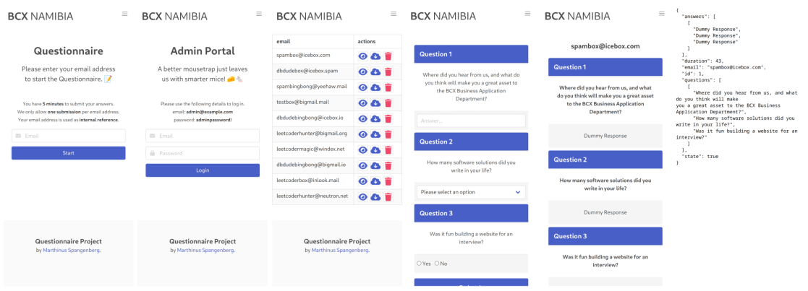

# Form Project

I have been tasked with completing a small full-stack project over the course of about 72 hours. The project touches on frontend web development as well as backend tasks like endpoint routing, form handling and database interactions. More broadly the emphasis is on writing clean, reusable code that respects modern software development standards and best practices. I have been allowed to complete the core requirements outlined in the provided project file in a language and framework of my choice: Python and Flask paired with SQLite as the database.

## Screenshots

Some screenshots of the project from a mobile device to showcase my considerations for responsive design on smaller screens. I don't consider myself a graphic designer, but from a UI/UX perspective, I think the clean, simple pallette helps with readability. I just wish I had time to work in a "night mode"! :) A point of pride - the only javascript in the project is for the mobile view burger-menu.

From left to right, top to bottom:

* The landing page, which acts as the questionnaire portal. email addresses are only superficially validated by the client, I didn't have time to write something to do more complex validation, but if I did, I would probably do something along the lines of creating a email which with a confirmation code in order to cut down on spam. I did create checks for resubmission though.
* The admin page, which acts as the administrative portal's login. I made use of Flask-Login for context management in order to have protected routes, but the password hashing and storage is all flask and sql-alchemy.
* The submission review page, from here the superuser can review individual forms, request a json copy of the questionnaire, or delete the submission and its associated applicant data.
* The actual questionnaire form, auto generated from the database. This had me burning the midnight oil because I was unsure of the best approach for modeling the database in a way which I can reconstruct questionnaires but still be able to modify the questionnaire's state over time... and by the time I decided on a direction for a schema, I had to backtrack and rework code in the rest of the project. Wasted some time - but a lot was learnt!
* A review page for an dummy questionnaire. I think the one thing that stood out at me from the start of this project was how to cleanly move data from queries to the templating engine and back into the backend for processing. I think if I had a fresh start I might consider going 100% API calls for all operations instead of the mix of form submissions and API CRUD endpoints currently in use.
* A json copy of the dummy submission. I decided to cobble together something quick for this that just stuffs queries into a dictionary and convert it to json with Flask's jsonify.




## Evaluation

So below is my interpretation, or understanding of the evaluation criteria for this project. With so much going on in such a short space of time, it was hard for me to reference every single point in this list, but I made a conscious effort to at least hit the broad strokes.

* **Code Reusability**
  * How modular is the codebase and can portions of it be reused easily?
* **Code Maintenance**
  * How difficult is it to keep the code maintained over time?
* **Code Documentation**
  * How well are features and design choices documented in the codebase?
* **Object Orientation**
  * To what degree is OOP being implemented to leverage the benefits of instantiation and inheritance?
* **Database Design**
  * How well thought out is the DB schema, are good practices being implemented in the design?
* **Generics**
  * How flexible are your functions and classes and can they handle mixed types?
* **Method Constructions**
  * Do you make use of constructors?
* **MVC Implementation**
  * Are you making full use of the Mode-View-Controller architecture pattern?
* **Code Structure and Architecture**
  * How understandable and neat is your codebase's layout and the project's structure?
* **Polymorphism**
  * Are you correctly implementing parent-child inheritance?

## Application Flow

The flow pattern during usage by either an applicant in the questionnaire portal or a privileged user in the admin portal. I threw this little drawing together at the very beginning of the project to act as a guide for how I want to lay out my templating and also my routing.


## Templates
Structure of my templates. I wanted to draw a nice dependency diagram but didn't have time.

```bash
Questionnaire Project
│
├── 404.html
├── 500.html
├── admin.html
├── build.html
├── confirm.html
├── elements
│   ├── base.html
│   ├── footer.html
│   ├── form_answer.html
│   ├── form_input.html
│   ├── form_radio.html
│   ├── form_row.html
│   ├── form_select.html
│   ├── nav.html
│   └── notification.html
├── form.html
├── index.html
├── login.html
└── review.html

```

## Database Schema

There was much wailing and gnashing of teeth trying to decide if I should just do 'good enough' normalization and focus on getting a minimum viable product ready for deadline, or spend some time building out an epic database with all the decoupling and BCNF anyone could wish for. Ended up spending too much time worrying about schema, but this is a middle of the road version that works, at least.

```sql
CREATE TABLE applicant (
	id INTEGER NOT NULL, 
	email VARCHAR(64) NOT NULL, 
	state BOOLEAN, 
	duration INTEGER, 
	PRIMARY KEY (id), 
	UNIQUE (email)
);
CREATE TABLE user (
	id INTEGER NOT NULL, 
	email VARCHAR(64), 
	password VARCHAR(128), 
	PRIMARY KEY (id), 
	UNIQUE (email)
);
CREATE TABLE form_state (
	id INTEGER NOT NULL, 
	version INTEGER, 
	question VARCHAR(256), 
	input_type VARCHAR(32), 
	choice VARCHAR(64), 
	PRIMARY KEY (id)
);
CREATE TABLE form_session (
	id INTEGER NOT NULL, 
	applicant_id INTEGER, 
	answer VARCHAR(1024), 
	date DATETIME, 
	state_id INTEGER, 
	PRIMARY KEY (id), 
	FOREIGN KEY(applicant_id) REFERENCES applicant (id), 
	FOREIGN KEY(state_id) REFERENCES form_state (id)
);
```

## Deployment

I really wanted to put together a docker image for this, and you can see the initial files for it in the repo. but I just didn't have time. Way too many spinning plates. You'll have to be happy with the admittedly linux-centric instructions below, but they should work just find on a windows machine with Python and Pip installed.

### Instructions

You'll need to have `git`, `pip`, `python` available to follow the instructions below.

Run with Pipenv:

```bash
# clone this repository
git clone https://github.com/m-spangenberg/interview-project.git forms
# change directory to the repo. folder
cd ./forms
# make sure you have pipenv installed
pip install --user pipenv
# install the needed dependencies from the piplock file
pipenv install 
# or if you prefer use the requirements.txt file
pipenv run flask --app questionnaire --debug run --host=0.0.0.0
```

If you're on a Windows machine make sure you've got Python properly installed then:

```bash
# download and extract the repository
https://github.com/m-spangenberg/interview-project/archive/refs/heads/main.zip
# open up the command-line inside the extracted folder
pip install -r requirement.txt
# run flask's testing server
flask --app questionnaire --debug run --host=0.0.0.0
# you'll be able to access the server at http://127.0.0.1:5000
```

Feel free to add some questionnaire submission or log into the admin portal, I've generated dummy data for you to test the delete,review and export buttons. I didn't have time to finish building the builder portion of the project, but I've left the button and route in place for you to inspect it.

## Final Thoughts

I had fun building this project and I learned a few new tricks along the way. I got stuck over-optimizing and eventually had to settle for a middle of the road solution because of time constraints, but overall I am very happy with the progress I made up to the deadline.

That said, I was not completely happy with the version of the project I delivered to the team on deadline and so I put in few more hours of work on Sunday to bring the project up to scratch. The form builder portion of the project might not be done, and I never got to putting a timer on the form submission page, but I'm happy with the result and I gave it a fair shot.

